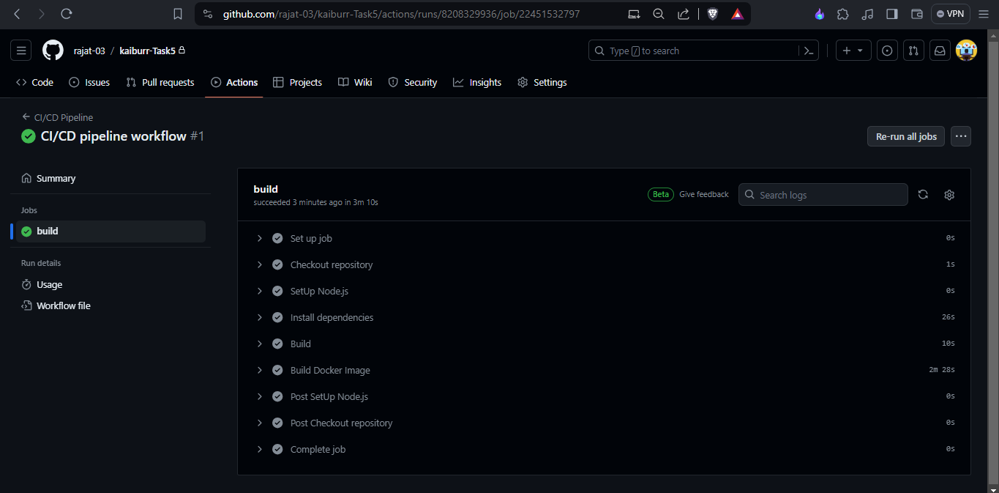

## Kaiburr Task 5: CI-CD Pipeline

### Workflow Configuration

The CI/CD pipeline is defined using GitHub Actions workflows. The workflow file is located at `.github/workflows/code&docker_build.yaml`. This file contains the configuration for the pipeline stages and steps.

The workflow is triggered automatically on every push to the main branch of the repository. It includes the following stages:

1. **Build**: Checks out the repository, sets up Node.js, installs dependencies, and builds the application.
2. **Build Docker Image**: Builds a Docker image for the application using the Dockerfile.

### Workflow Steps

Each stage in the workflow consists of multiple steps, which are executed sequentially. These steps perform various tasks such as:

- Checking out the source code from the repository.
- Setting up Node.js environment and installing dependencies.
- Building the application using npm scripts.
- Building a Docker image for the application using `docker build` command.

### Viewing CI/CD Pipeline Results

To view the results of the CI/CD pipeline execution, follow these steps:

1. Navigate to the **Actions** tab of the GitHub repository.
2. Here you will see a list of workflow runs triggered by recent pushes or manual dispatches.
3. Click on the workflow run you want to inspect to view detailed information, including logs for each step, execution status, and any associated artifacts.
